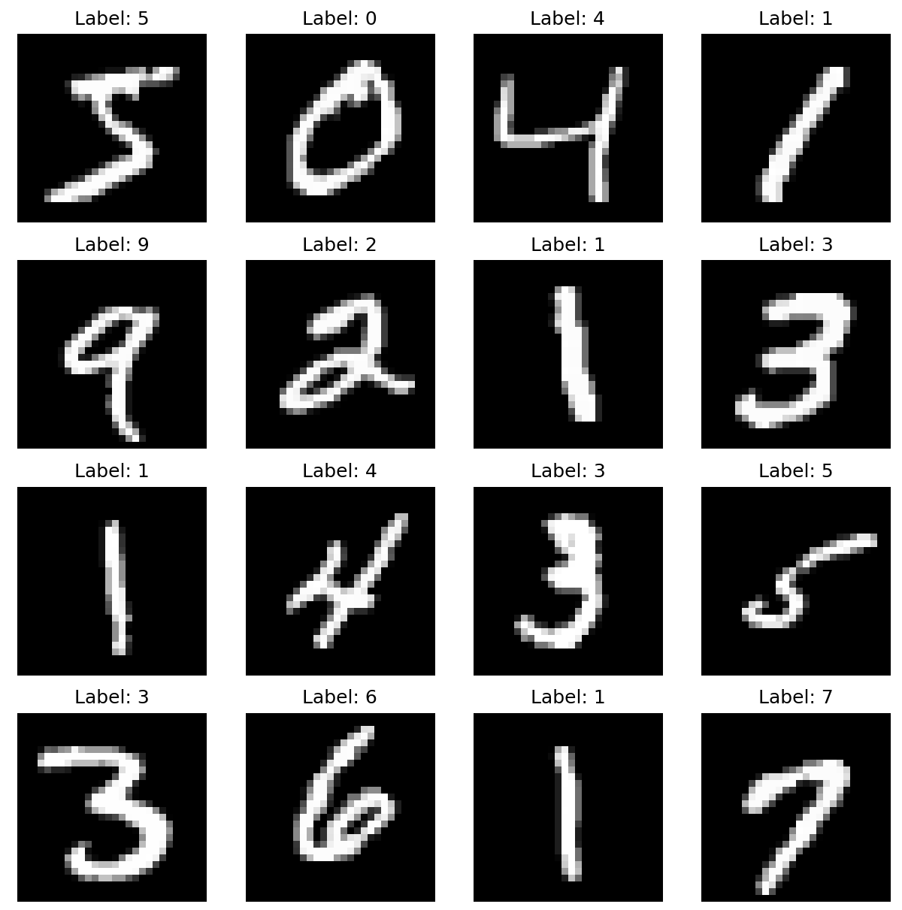
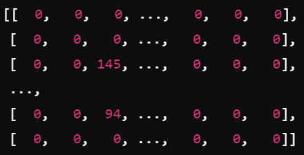
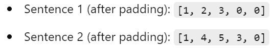
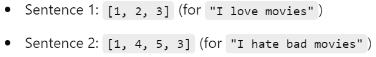
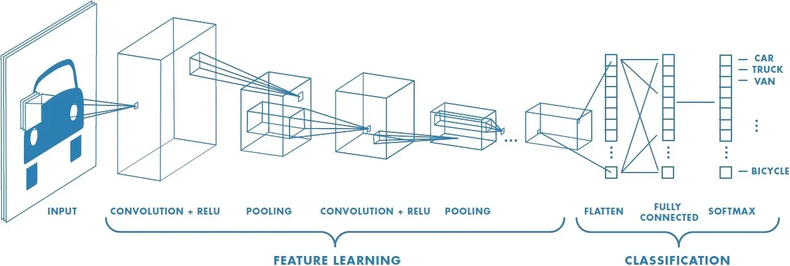

## AI Projects

### 1. Iris Flower Classification
The Iris flower classification project is based on a K-Nearest Neighbors (KNN) algorithm.

- **Non-parametric**
- **Supervised** - Training is done with inputs and their corresponding outputs
- **Popular, Simple** - Used for classification and regression in Machine Learning
- **Distance Metrics** - Commonly uses Euclidean, Manhattan, Minkowski, and Hamming distances

#### Classification Algorithm

#### Conclusion
The classification of different species of Iris flowers was completed using the KNN algorithm. First, the iris data was divided into training and testing sets. The model was trained using the training data and then tested on the test data. The trained model was then used to classify the species of Iris flowers.

---

### 2. MNIST Digit Recognition
This project classifies handwritten digits (0-9) from the MNIST dataset using a Multi-Layer Perceptron (MLP) Neural Network.

#### MNIST Data Set
The handwritten digits are represented by grayscale matrices of 28x28 pixels, with values ranging from 0 to 255. This dataset is stored in `.npz` files.

Each digit has its own label (0-9) and is separated into training and testing sets. Normalizing the data improves the learning process and helps mitigate gradient-related issues. The MLP model includes:
- An input layer
- Two hidden layers with ReLU activation
- An output layer of 10 neurons with softmax activation for probability distribution across the 10 classes
- Trained for 5 epochs using the Adam optimizer.

---

### 3. Reviews Classification
In this project, IMDb reviews are classified as positive or negative.

- **Data** - Stored in TensorFlow tensors, with sentences and labels separated for supervised training.
- **Data Preparation** - Sentences are tokenized and padded to the same length. Missing tokens are represented by an "Out-of-Vocabulary" (OOV) token.

#### Tokenizing and Padding

The neural network used is a feedforward NN with backpropagation:
1. **Embedding Layer** - Each tokenized word is transformed into a 16-dimensional random vector.
2. **Pooling Layer** - Averages each vector word of a sentence into one vector, reducing dimensions and standardizing input.
3. **Hidden Layer** - With ReLU activation.
4. **Output Layer** - Sigmoid activation for binary classification of 0 or 1.

---

### 4. Image Recognition
This project uses a Convolutional Neural Network (CNN) for image recognition.

- **Dataset** - CIFAR-10 containing 60,000 images with pixel values 0-255. Training and testing sets are normalized for improved model speed and accuracy.
- **Model Architecture** - Includes convolutional layers for feature extraction, pooling layers for dimension reduction, a Flatten layer, and a Dense layer for classification.
